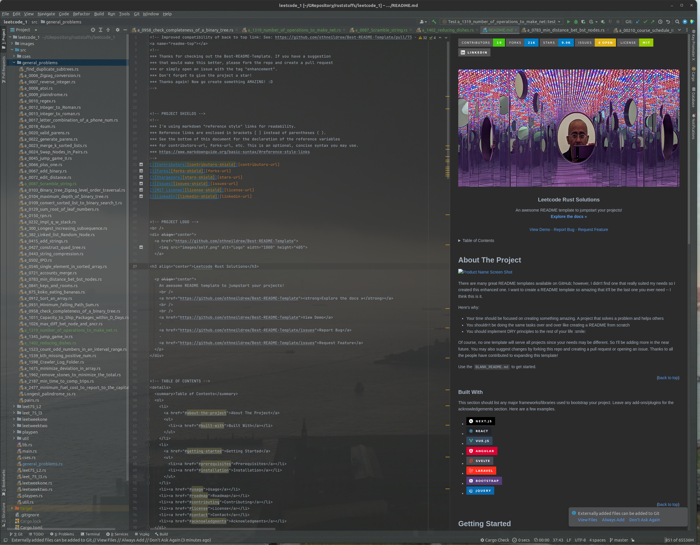

<!-- Improved compatibility of back to top link: See: https://github.com/othneildrew/Best-README-Template/pull/73 -->
<a name="readme-top"></a>
<!--
*** Thanks for checking out the Best-README-Template. If you have a suggestion
*** that would make this better, please fork the repo and create a pull request
*** or simply open an issue with the tag "enhancement".
*** Don't forget to give the project a star!
*** Thanks again! Now go create something AMAZING! :D
-->


<!-- PROJECT SHIELDS -->
<!--
*** I'm using markdown "reference style" links for readability.
*** Reference links are enclosed in brackets [ ] instead of parentheses ( ).
*** See the bottom of this document for the declaration of the reference variables
*** for contributors-url, forks-url, etc. This is an optional, concise syntax you may use.
*** https://www.markdownguide.org/basic-syntax/#reference-style-links
-->

[![Stargazers][stars-shield]][stars-url]
[![Issues][issues-shield]][issues-url]
[![MIT License][license-shield]][license-url]
[![LinkedIn][linkedin-shield]][linkedin-url]


<!-- PROJECT LOGO -->
<br />
<div align="center">
  <a href="https://github.com/othneildrew/Best-README-Template">
    
  </a>

<h3 align="center">Leetcode Rust Solutions</h3>

  <p align="center">
    Use at your own risk.  A work in progress a few are incomplete 
    <br />

  </p>
</div>


<!-- TABLE OF CONTENTS -->
<details>
  <summary>Table of Contents</summary>
  <ol>
    <li>
      <a href="#about-the-project">About The Project</a>
      <ul>
        <li><a href="#built-with">Built With</a></li>
      </ul>
    </li>
    <li>
      <a href="#getting-started">Getting Started</a>
      <ul>
        <li><a href="#prerequisites">Prerequisites</a></li>
        <li><a href="#installation">Installation</a></li>
      </ul>
    </li>
    <li><a href="#usage">Usage</a></li>
    <li><a href="#roadmap">Roadmap</a></li>
    <li><a href="#contributing">Contributing</a></li>
    <li><a href="#license">License</a></li>
    <li><a href="#contact">Contact</a></li>
    <li><a href="#acknowledgments">Acknowledgments</a></li>
  </ol>
</details>


<!-- ABOUT THE PROJECT -->
## About The Project
<div align="left">
  <a href="https://github.com/othneildrew/Best-README-Template">
    
  </a>
</div>

This is my personal repo of Rust Leetcode solutions. Use at your own risk. Most of the solutions are mine some have been copied.

This is a work in progress:
* Things will change drastically
* This is not a canonical reference and not meant to infringe on any copyrighted material. My 
* As a good acquaintance warns: **DON'T USE THIS CODE!!**   
* **PLEASE DON"T USE THIS CODE!!!**


<p align="right">(<a href="#readme-top">back to top</a>)</p>


### Built With

Rust 
* [![Rust][Rust.rs]][Rust-url]


<p align="right">(<a href="#readme-top">back to top</a>)</p>


<!-- GETTING STARTED -->
## Getting Started

Don't use this code

### Prerequisites


* rust
  ```sh
  npm install npm@latest -g
  ```

### Installation

_Below is an example of how you can instruct your audience on installing and setting up your app. This template doesn't rely on any external dependencies or services._

1. Install Rust
   ```sh
   curl --proto '=https' --tlsv1.2 -sSf https://sh.rustup.rs | sh

   ```
2. Don't clone this repo

<p align="right">(<a href="#readme-top">back to top</a>)</p>


<!-- USAGE EXAMPLES -->
## Usage

This code is for example purposes only. Don't use it for anything. 

<p align="right">(<a href="#readme-top">back to top</a>)</p>


<!-- ROADMAP -->
## Roadmap
Really TODOS but who cares

- [ ] Add A Better Readme
- [ ] Remove history and clean up the repo


See the [open issues](https://github.com/dbrowne/leetcode_1/issues) for a full list of proposed features (and known issues).

<p align="right">(<a href="#readme-top">back to top</a>)</p>


<!-- CONTRIBUTING -->
## Contributing

Please Don't.  


<p align="right">(<a href="#readme-top">back to top</a>)</p>


<!-- LICENSE -->
## License

Distributed under the MIT License. See `LICENSE.txt` for more information.

<p align="right">(<a href="#readme-top">back to top</a>)</p>


<!-- CONTACT -->
## Contact

Your Name - [@your_twitter](https://twitter.com/your_username) - email@example.com

Project Link: [https://github.com/dbrowne/leetcode_1](https://github.com/dbrowne/leetcode_1)

<p align="right">(<a href="#readme-top">back to top</a>)</p>


<!-- ACKNOWLEDGMENTS -->
## Acknowledgments

This README is from [The Best-README-Template] (https://github.com/othneildrew/Best-README-Template)

* [Choose an Open Source License](https://choosealicense.com)
* [GitHub Emoji Cheat Sheet](https://www.webpagefx.com/tools/emoji-cheat-sheet)
* [Malven's Flexbox Cheatsheet](https://flexbox.malven.co/)
* [Malven's Grid Cheatsheet](https://grid.malven.co/)
* [Img Shields](https://shields.io)
* [GitHub Pages](https://pages.github.com)
* [Font Awesome](https://fontawesome.com)


<p align="right">(<a href="#readme-top">back to top</a>)</p>


<!-- MARKDOWN LINKS & IMAGES -->
<!-- https://www.markdownguide.org/basic-syntax/#reference-style-links -->
[contributors-shield]: https://img.shields.io/github/contributors/othneildrew/Best-README-Template.svg?style=for-the-badge
[contributors-url]: https://github.com/othneildrew/Best-README-Template/graphs/contributors
[stars-shield]:https://img.shields.io/github/commit-activity/m/dbrowne/leetcode_1
[stars-url]: https://img.shields.io/github/commit-activity/m/dbrowne/leetcode_1
[issues-shield]: https://img.shields.io/github/issues-raw/dbrowne/leetcode_1
[issues-url]: https://img.shields.io/github/issues-raw/dbrowne/leetcode_1
[license-shield]: https://img.shields.io/github/license/othneildrew/Best-README-Template.svg
[license-url]: https://github.com/othneildrew/Best-README-Template/blob/master/LICENSE.txt
[linkedin-shield]: https://img.shields.io/badge/-LinkedIn-black.svg?logo=linkedin&colorB=555
[linkedin-url]: https://linkedin.com/in/dwightbrowne
[Rust.rs]: https://www.rust-lang.org/logos/rust-logo-128x128.png
[Rust-url]: https://www.rust-lang.org/


